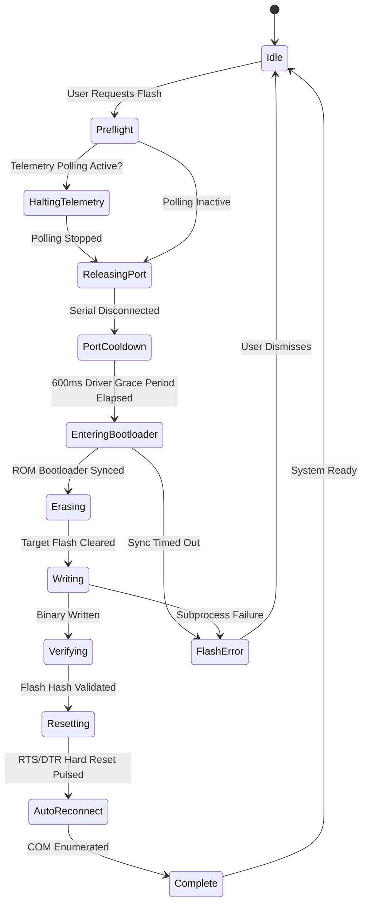

# Spec 007 — Scalable Architecture, Directory Structure & Factory Design Patterns

> **Status**: Approved Architectural Blueprint  
> **Role**: Architecture Hardening & Enterprise Scalability (Foundation for Specs 008+)  
> **Target Subsystems**: Creative Studio (`src/`), Native Bridge (`src-tauri/`), ESP32 Firmware (`firmware/`)

---

## 1. Context & Architectural Principles

PixelForge bridges embedded silicon diagnostics with desktop-class creative software. As the product expands toward **Component & Wiring Graphs**, **Hardware Workspaces**, and **Virtual ESP32 Simulation**, the codebase must transition from early rapid prototyping ("vibe-coding") to an **extensible, domain-driven architecture**.

### Primary Failure Modes Addressed
1. **Monolithic God-Files**: Giant multi-thousand-line modules mixing serial opcodes, UI presentation, canvas rasterization, and file I/O.
2. **Hardcoded Monochrome OLED Assumptions**: Hardcoding $128 \times 64$, 1-bit monochrome, and 1,024-byte buffer layouts directly in algorithms, preventing support for $128 \times 32$ displays, 4-bit grayscale displays (SSD1322), or future ST7789 displays.
3. **Coupled Hardware Transports**: Views invoking Tauri serial commands directly, preventing network transports (WiFi/WebSocket) and headless testing.
4. **Ad-Hoc Async State**: Loose, untracked booleans (`isLoading`, `isDoingSomething`) causing COM port handle collisions during firmware flashing.

### Core Architectural Rule: Clean Dependency Flow
All interactions strictly follow this one-way dependency chain:

```text
UI (Vue Views / Components)
       ↓
Stores (Pinia State Machines)
       ↓
Domain Services & Strategies (Pure TS / Business Logic)
       ↓
Interfaces / Abstractions (ITransport, IPackingStrategy, IDitherStrategy)
       ↓
Adapters (Tauri IPC Adapter, WebSocket Adapter, Mock Adapter)
       ↓
Tauri IPC Boundary (Rust Native Core)
       ↓
Physical Device / System Subprocesses
```

> [!IMPORTANT]
> **Strict Invariant**: A Vue component must NEVER import serial drivers or call low-level transport handles directly. All hardware interactions flow through stores that enforce strict state machines.

---

## 2. Pragmatic Pattern Selection (Avoiding Pattern Bloat)

To keep the codebase lean and prevent over-engineering:
- **Multiple interchangeable implementations** $\rightarrow$ **Strategy + Registry / Factory**  
  *(e.g., Dithering algorithms, Export formats, Hardware Transports)*
- **Single or tightly coupled implementations** $\rightarrow$ **Direct class instantiation**  
  *(e.g., standard page packing routines, specialized UI widgets)*

```text
Interchangeable Algorithms (Dithering, Code Export)
        ↓
Strategy + Registry/Factory

Single Static Implementation
        ↓
Direct Dependency
```

---

## 3. The Creative Domain: Dithering Strategy Pattern

### A. The Corrected Mathematical Specification
Dithering algorithms operate on normalized `Float32Array` luminance buffers $(0.0 - 255.0)$. Bitwise shifts (`>>`) must never be used on floating-point error buffers because JavaScript coerces floats to 32-bit signed integers before shifting, causing truncation errors.

Error distribution must use true floating-point division:

```typescript
// src/strategies/dither/DitherStrategy.ts
export interface DitherContext {
  width: number;
  height: number;
  contrast: number;     // -100 to 100
  brightness: number;   // -100 to 100
  gamma: number;        // 0.2 to 3.0
  blackPoint: number;   // 0 to 100
  invert: boolean;
}

export interface IDitherStrategy {
  readonly id: string;
  readonly name: string;
  readonly description: string;
  
  process(grayscale: Float32Array, ctx: DitherContext): Uint8Array;
}
```

```typescript
// src/strategies/dither/AtkinsonDither.ts
import type { IDitherStrategy, DitherContext } from './DitherStrategy';

export class AtkinsonDither implements IDitherStrategy {
  readonly id = 'atkinson';
  readonly name = 'Atkinson (Macintosh 1984)';
  readonly description = 'High-contrast 1/8th error diffusion preserving crisp highlights.';

  process(pixels: Float32Array, ctx: DitherContext): Uint8Array {
    const { width, height } = ctx;
    const output = new Uint8Array(width * height);
    const buffer = new Float32Array(pixels); // Mutable working buffer

    for (let y = 0; y < height; y++) {
      for (let x = 0; x < width; x++) {
        const idx = y * width + x;
        const oldVal = buffer[idx];
        const newVal = oldVal > 127 ? 255 : 0;
        output[idx] = newVal === 255 ? 1 : 0;

        // Correct: Floating-point error divided by 8
        const err = (oldVal - newVal) / 8;

        // Atkinson 1/8 distribution:
        //       [P]   1/8   1/8
        // 1/8   1/8   1/8
        //       1/8
        if (x + 1 < width) buffer[idx + 1] += err;
        if (x + 2 < width) buffer[idx + 2] += err;
        if (y + 1 < height) {
          if (x - 1 >= 0) buffer[(y + 1) * width + (x - 1)] += err;
          buffer[(y + 1) * width + x] += err;
          if (x + 1 < width) buffer[(y + 1) * width + (x + 1)] += err;
        }
        if (y + 2 < height) {
          buffer[(y + 2) * width + x] += err;
        }
      }
    }
    return output;
  }
}
```

### B. Dither Registry
```typescript
// src/factories/DitherEngineFactory.ts
import type { IDitherStrategy } from '@/strategies/dither/DitherStrategy';
import { AtkinsonDither } from '@/strategies/dither/AtkinsonDither';
import { FloydSteinbergDither } from '@/strategies/dither/FloydSteinbergDither';
import { BayerDither } from '@/strategies/dither/BayerDither';
import { OtsuThresholdDither } from '@/strategies/dither/OtsuThresholdDither';

export class DitherEngineFactory {
  private static registry = new Map<string, IDitherStrategy>([
    ['atkinson', new AtkinsonDither()],
    ['floyd-steinberg', new FloydSteinbergDither()],
    ['bayer', new BayerDither()],
    ['threshold', new OtsuThresholdDither()],
  ]);

  static getStrategy(id: string): IDitherStrategy {
    return this.registry.get(id) || this.registry.get('atkinson')!;
  }

  static getAvailableAlgorithms(): Array<{ id: string; name: string; description: string }> {
    return Array.from(this.registry.values()).map(s => ({
      id: s.id,
      name: s.name,
      description: s.description,
    }));
  }
}
```

---

## 4. Hardware Domain: Decoupled Display & Connection Abstraction

### A. Separation of Concerns: Display vs. Connection
A common architectural flaw is coupling **what the display is** with **how it is currently wired**:
- A display specification (dimensions, color depth, controller command set) does not change whether connected via I2C at `0x3C`, I2C at `0x3D`, or SPI.
- Therefore, `DisplayProfile` defines the screen's intrinsic hardware traits, while `DisplayConnection` represents the dynamic physical link.

```text
DisplayProfile (Intrinsic Screen Traits)
├── width
├── height
├── pixelFormat ('mono-1' | 'gray-4' | 'rgb565')
├── controller ('SSD1306' | 'SH1106' | 'SSD1309' | 'SSD1322')
└── packingStrategy (IPackingStrategy)

DisplayConnection (Dynamic Wiring Instance)
├── transport ('I2C' | 'SPI')
├── i2cAddress (e.g. 0x3C, 0x3D)
├── spiPins ({ mosi, sclk, cs, dc, rst })
└── clockSpeedHz (e.g. 400000)
```

### B. Multiformat Memory Model
Displays possess different pixel formats and buffer sizes:
- **`mono-1`**: 1 bit/pixel $\rightarrow (W \times H) / 8$ bytes (e.g. $128 \times 64 = 1024$ bytes)
- **`gray-4`**: 4 bits/pixel (16 grayscale levels) $\rightarrow (W \times H) / 2$ bytes (e.g. $256 \times 64 \text{ SSD1322} = 8192$ bytes)
- **`rgb565`**: 16 bits/pixel $\rightarrow (W \times H) \times 2$ bytes

```typescript
// src/core/display/DisplayProfile.ts
import type { IPackingStrategy } from '@/strategies/packing/PackingStrategy';

export type PixelFormat = 'mono-1' | 'gray-4' | 'rgb565';

export interface DisplayProfileConfig {
  id: string;
  name: string;
  width: number;
  height: number;
  pixelFormat: PixelFormat;
  controller: 'SSD1306' | 'SH1106' | 'SSD1309' | 'SSD1322';
  packingStrategy: IPackingStrategy;
}

export class DisplayProfile {
  readonly id: string;
  readonly name: string;
  readonly width: number;
  readonly height: number;
  readonly pixelFormat: PixelFormat;
  readonly controller: string;
  readonly frameBytes: number;
  private readonly packingStrategy: IPackingStrategy;

  constructor(config: DisplayProfileConfig) {
    this.id = config.id;
    this.name = config.name;
    this.width = config.width;
    this.height = config.height;
    this.pixelFormat = config.pixelFormat;
    this.controller = config.controller;
    this.packingStrategy = config.packingStrategy;

    // Dynamically calculate frameBytes based on pixelFormat
    switch (config.pixelFormat) {
      case 'mono-1':
        this.frameBytes = (config.width * config.height) / 8;
        break;
      case 'gray-4':
        this.frameBytes = (config.width * config.height) / 2;
        break;
      case 'rgb565':
        this.frameBytes = config.width * config.height * 2;
        break;
    }
  }

  pack(canonicalPixels: Uint8Array): Uint8Array {
    return this.packingStrategy.pack(canonicalPixels, this.width, this.height);
  }

  unpack(packedBytes: Uint8Array): Uint8Array {
    return this.packingStrategy.unpack(packedBytes, this.width, this.height);
  }
}
```

---

## 5. Transport Layer Architecture: Two Distinct Tiers

The transport architecture is explicitly separated into two clean layers:

```text
                  DeviceTransport (Conceptual Interface)
                              │
         ┌────────────────────┴────────────────────┐
         │                                         │
  Frontend Adapter Layer                     Rust Transport Layer
  (src/strategies/transport/)                (src-tauri/src/transports/)
         │                                         │
  ITransport (TS Interface)                  DeviceTransport (Rust Trait)
         │                                         │
  ├── TauriSerialAdapter                     ├── SerialTransport (serialport-rs)
  ├── WebSocketAdapter                       └── TcpTransport (tokio-net)
  └── MockTransport (Echo/Unit Test)                       │
         │                                         ▼
         ▼                                  Physical USB-UART
  Tauri IPC Command Boundary
```

### A. Frontend Adapter (`ITransport`)
The frontend `ITransport` does **NOT** re-implement a serial communication stack. Its role is solely to insulate the Pinia store from whether it is executing inside Tauri IPC, over a WebSocket, or against a headless mock.

```typescript
// src/strategies/transport/ITransport.ts
export interface TransportEventMap {
  connected: void;
  disconnected: void;
  data: Uint8Array;
  error: Error;
}

export interface ITransport {
  readonly id: string;
  readonly isConnected: boolean;

  connect(target: string, config?: any): Promise<void>;
  disconnect(): Promise<void>;
  send(packet: Uint8Array): Promise<void>;
  on<K extends keyof TransportEventMap>(event: K, handler: (payload: TransportEventMap[K]) => void): void;
}
```

### B. Distinction: MockTransport vs. Future Virtual Simulator
- **`MockTransport`**: An in-memory software test stub that simulates packet round-trips (echoing PING ACKs, dummy telemetry) so that CI/CD and frontend unit tests can run in pure Node/browser environments without hardware or Tauri binaries.
- **`Virtual ESP32 Simulator` (Spec 010)**: A comprehensive emulation subsystem featuring a virtual Xtensa core, virtual GPIO matrix, I2C bus state machine, and simulated SSD1306 OLED framebuffers.

---

## 6. Finite State Machines (FSM) for Hardware Safety

Unconstrained boolean flags (`isConnecting`, `isFlashing`) lead to handle collisions. Hardware communication is governed by explicit state machines.

### A. Device Connection FSM
```text
[Disconnected] ──(Scan)──► [Scanning] ──(Complete)──► [Disconnected]
       │
   (Connect)
       ▼
 [Connecting] ──(Handle Open)──► [Handshaking] ──(Ping ACK)──► [Online]
       │                                │                         │
    (Error)                          (Timeout)              (Disconnect)
       ▼                                ▼                         ▼
    [Error] ◄─────────────────────── [Error]               [Disconnecting]
       │                                                          │
    (Reset)                                                 (Handle Free)
       ▼                                                          ▼
 [Disconnected]                                             [Disconnected]
```

```typescript
export type DeviceConnectionState =
  | 'Disconnected'
  | 'Scanning'
  | 'Connecting'
  | 'Handshaking'
  | 'Online'
  | 'Disconnecting'
  | 'Error';
```

### B. ESP32 Flasher FSM
The ESP32 flashing sequence requires exclusive access to the serial port. The FSM guarantees that the normal runtime serial handle is freed and stabilized before `esptool.py` is invoked.



```typescript
export type FlashState =
  | 'Idle'
  | 'Preflight'
  | 'HaltingTelemetry'
  | 'ReleasingPort'
  | 'PortCooldown'
  | 'EnteringBootloader'
  | 'Erasing'
  | 'Writing'
  | 'Verifying'
  | 'Resetting'
  | 'AutoReconnect'
  | 'Complete'
  | 'Error';
```

---

## 7. Exporter Strategy Pattern

Export generation is decoupled into uniform strategy modules:

```typescript
// src/strategies/export/ExportStrategy.ts
import type { DisplayProfile } from '@/core/display/DisplayProfile';

export interface ExportOptions {
  variableName: string;
  includeDrawFunction: boolean;
  fps: number;
  loop: boolean;
}

export interface ExportResult {
  filename: string;
  mimeType: string;
  data: string | Uint8Array;
}

export interface IExportStrategy {
  readonly id: string;
  readonly name: string;
  readonly fileExtension: string;
  readonly description: string;
  
  exportFrames(
    frames: Uint8Array[],
    profile: DisplayProfile,
    options: ExportOptions
  ): Promise<ExportResult>;
}
```

Standalone Strategy Implementations:
- `ArduinoSketchExporter`: Generates `.ino` files with `Adafruit_SSD1306`.
- `CppHeaderExporter`: Generates `.h` PROGMEM byte arrays for U8g2 / direct C.
- `RawBinaryReelExporter`: Generates packed `.bin` files for direct ESP32 flash / SD card.
- `GifAnimationExporter`: Generates animated monochrome GIF previews.
- `MicroPythonExporter`: Generates Python scripts with `framebuf.bytearray`.

---

## 8. Migration Discipline: Phased Verification

To maintain stability, the migration proceeds in four isolated phases. 

> [!IMPORTANT]
> **Refactoring Rule**: Every phase MUST leave the application 100% operational.
> Before starting and after completing any phase, verify:
> 1. `npm run build` (`vue-tsc --noEmit && vite build`) exits with code 0.
> 2. `cargo check` in `src-tauri` exits with code 0.
> Never combine multiple phases into a single task.

```text
┌────────────────────────────────────────────────────────┐
│ Phase 1: Core Geometry & Display Profile Abstraction   │
│ - Create src/core/display/DisplayProfile.ts            │
│ - Implement PixelFormat ('mono-1', 'gray-4', etc.)     │
│ - Create DisplayProfileFactory with default 128x64     │
│ - Verify build & check                                 │
└───────────────────────────┬────────────────────────────┘
                            │ (Passing build)
                            ▼
┌────────────────────────────────────────────────────────┐
│ Phase 2: Dither Strategy Pattern Extraction            │
│ - Create src/strategies/dither/ with Atkinson/Floyd    │
│ - Implement true floating point /8 math                │
│ - Connect DitherEngineFactory                          │
│ - Verify build & check                                 │
└───────────────────────────┬────────────────────────────┘
                            │ (Passing build)
                            ▼
┌────────────────────────────────────────────────────────┐
│ Phase 3: Exporter Strategy Extraction                  │
│ - Split monolithic videoExporter.ts into strategies    │
│ - Connect ExporterFactory                              │
│ - Verify build & check                                 │
└───────────────────────────┬────────────────────────────┘
                            │ (Passing build)
                            ▼
┌────────────────────────────────────────────────────────┐
│ Phase 4: FSM Hardening & Transport Adapter             │
│ - Migrate device.ts and flasher.ts to explicit FSMs    │
│ - Integrate MockTransport for headless unit tests      │
│ - Verify build & check                                 │
└────────────────────────────────────────────────────────┘
```
